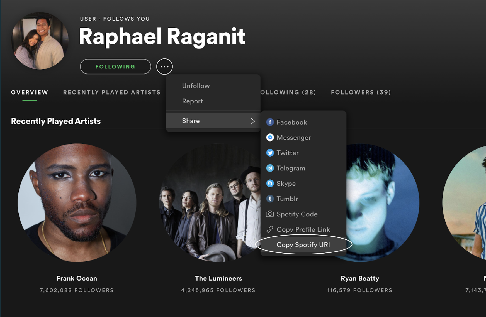
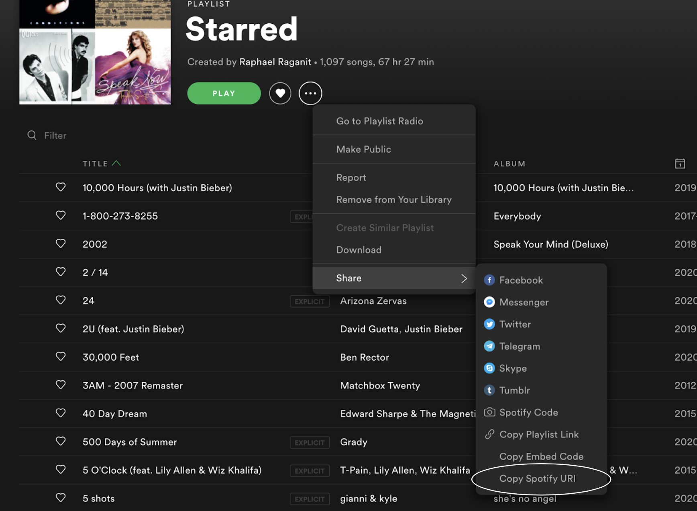

# Introduction
The mood maker is a program that is able to detect 4 different emotions using the user's webcam. These being angry, happy, neutral and sad. From these detected emotions, given the playlist and user APIs, the program will then provide a song from the user's playlist that would best fit their mood.

# Libraries Used
* Pandas
* NumPy
* Os
* Glob
* Pillow
* TensorFlow
* Keras
* Scikit-Learn
* CV2
* iMutils
* Spotipy

# Components
There are going to be multiple components that go into the project. One cannot just poof a machine learning project into existence, instead it is broken down into different parts and then combined together. I had first created a model that can differentiate the different emotions shown on a human's face and then placed that model into a program that can connect to the user's webcam. Afterwards, the detected emotion would get input into the recommender system in order to produce a song that is correlated with the user's emotions. 

## Creating the Emotion Model

### Data

In order to create a program that can detect emotions, we have to teach a computer how the facial expressions on a person's face changes as they go through the four different indicated emotions. This is done by feeding multiple images of each of the different expressions and creating a convolutional neural network. This part has an assumption built into the model. Not everybody expresses their emotions the same way especially outwardly on their face. The images that get fed into the CNN are going to be stereotypical in the sense that the faces within the images are going to be smiling when happy and frowning when sad. The images that were used came from the following Kaggle data set.

https://www.kaggle.com/mahmoudima/mma-facial-expression

### Formulating my best model

I had based my final CNN model from AlexNet. From the baseline AlexNet, my accuracy had improved 11% with the improvements I had done. The changes I made were tailored around the 48x48 pixel size of my images. In order to get the best results, I had added convolutional layers. This allowed my neural net to learn more about the images and to determine which weights and biases could be changed in order to find the minimum of my cost function. Next, I had reduced the amount of pooling layers. Since pooling layers are there to decrease the run time of the neural net but combining pixels, that wasn't as crucial with my dataset since my images were already small. Lastly, I had increased the amount of droupout layers I had. There is a higher chance of overfitting for my model with the increased amount of convolutional layers, so adding the droupout layers will prevent that when getting the accuracy of my model. 

### Metrics used

Classes: 4 (Happy, Sad, Neutral, Angry)

Loss: Categorical Crossentropy

Optimizer: Adam

## Connecting to Webcamera

### CV2 and openCV

## Creating the Spotify Recommender System

### Data
I had found playlists that had songs which had matched each of my 4 emotions. For example, for happy songs, I used a dance, upbeat playlist and for angry, I had used a intense and loud playlist. I am aware that these playlists are created from my personal bias as to what I want to listen to when I'm experiencing these specific emotions and that from person-to-person. The preferences for what other people might want to listen to are not the same as mine, but rather it's a generalization of the songs usually listened to when these emotions are being felt. 

Spotify has a machine learning algorithm that calculates different variables for each of the songs. The variables are:
* Danceability
* Energy
* Loudness
* Speechiness
* Acousticness
* Instrumentalness
* Liveness
* Valence
* Tempo

# How to use

